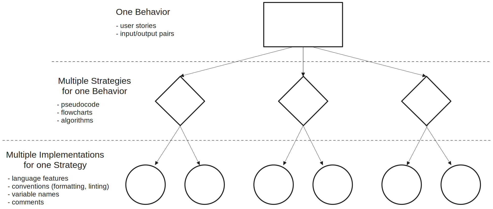

# Behavior, Strategy, Implementation

3 different ways to understand the same program.

<br/>



<br/>

## Behavior

What does the program do? What are it’s inputs and it’s outputs? How does a uers interact
with it? Behavior is all about what your program looks like "from the outside", without
looking at a single line of code.

Program behavior can be described with a **user story**, **acceptance criteria**, and
**input/output pairs** (_or_ **test cases**). Here are some examples describing the behavior
of a `reverses-string.js` program:

```js
/*
  -- USER STORY --
  a user can input a non-empty string and only the letters will be turned into a mirror
    -- ACCEPTANCE CRITERIA --
    - given the user cancels, they will be prompted again
    - given the input is empty, they will be prompted again
    - given their input is valid, the loop will exit and the mirrored letters will be displayed
  
  -- INPUT/OUTPUT PAIRS --
  test cases:
    only letters:
      'abc' -> 'abc|cba'
      'hello' -> 'hello|olleh'
      'JavaScript' -> 'JavaScript|tpircSavaJ'
    only not-letters:
      '.(-).' -> '|'
      '-=>|<=-' -> '|'
      '. - ^ - .' -> '|'
    mixed letters and not-letters:
      'hello!' -> 'hello|olleh'
      'good bye?' -> 'goodbye|eybdoog'
      'let input = ""' -> 'letinput|tupnitel'
*/
```

## Strategy

How do you approach solving the problem? There are many strategies to solve the same
problem! A way to practice strategy is to think of transforming the arguments to the
return value in small steps, _focusing on the data not the code_. This is the realm of
flow charts, diagrams, and pseudo-code.

One way to approach strategy is to solve the problem a few different ways by hand, writing
what you expect to change in memory at each step. Like if you were the debugger and you
couldn't see the source code. Using a pencil and paper is a the best way to go, pick a few
test cases and see how you'd solve them manually.

Here are three possible strategies to approach mirroring a string. Each one is written as
step-by-step goals focusing on _what_ should happen at each step, not _how_ it will
happen. This type of comment is helpful to include in your code:

### Reverse & Concatenate: _Strategy_

```js
// 1. get a string from the user
// 2. create a new reversed copy of the strings
// 3. combine the original string with the mirror string
// 4. display the mirrored string to the user
```

### Iterate Backwards: _Strategy_

```js
// 1. get a string from the user
// 2. create a string with only the "|" character
// 3. iterate backwards over the string
//		a. append each character on both sides of the new string
// 4. display the mirrored string to the user
```

### Reverse & Iterate: _Strategy_

```js
// 1. get a string from the user
// 2. create a new reversed copy of the string
// 3. create a string with only the "|" character
// 4. iterate forwards over the reversed string
// 		a. append each character to either side of the new string
// 5. display the mirrored string to the user
```

## Implementation

Which language features and which lines of code did you use to code your strategy? There
are many ways to implement the same strategy, and no single right answer! A good
implementation should be simple and clear, and help readers understand your strategy by
using helpful white space, variable names and comments (when necessary).

Below are 2 different implementations of each strategy described above, and some
discussion questions:

- Which implementation(s) do you think are the easiest to understand?
- Do you think more comments are helpful or distracting?
- Do you think long variables names are more helpful or distracting?
- Which implementation do you think is better, and why?
- How would you change the code to make it more understandable?

### Reverse & Concatenate: _Implementations_

```js
// 1. get a string from the user
let input = null;
while (input === null) {
	input = prompt('enter something');
}

// 2. create a new reversed copy of the strings
let reversed = '';
for (let nextChar of input) {
	reversed = nextChar + reversed;
}

// 3. combine the original string with the mirror string
let mirrorederorrim = input + '|' + reversed;

// 4. display the mirrored string to the user
alert(mirrorederorrim);
```

```js
// get a string from the users
let toMirror = null;
while (toMirror === null) {
	toMirror = prompt('Enter some text, it will be mirrored.');
}

// create a new backwards string
let mirrored = '';
for (let nextChar of toMirror) {
	// move each character from the end to the beginning
	mirrored = nextChar + mirrored;
}

// display your mirrorized string
alert('Here is your mirrored text: ' + toMirror + '|' + mirrored);
```

### Iterate Backwards: _Implementations_

```js
// 1. get a string from the user
let input = null;
while (input === null) {
	input = prompt('enter something');
}

// 2. create a string with only the "|" character
let mirrored = '|';

// 3. iterate backwards over the string
let index = input.length - 1;
while (index >= 0) {
	// a. append each character on both sides of the new string
	let nextChar = input[index];
	mirrored = nextChar + mirrored + nextChar;
	index = index - 1;
}

// 4. display the mirrored string to the user
alert(mirrored);
```

```js
let input = null;
while (input === null) {
	input = prompt('enter something');
}

let mirrored = '|';

let count = 1;
while (count <= input.length) {
	let nextChar = input[input.length - count];
	mirrored = nextChar + mirrored + nextChar;
	count = count + 1;
}

alert(mirrored);
```

### Reverse & Iterate: _Implementations_

```js
// 1. get a string from the user
let input = null;
while (input === null) {
	input = prompt('enter something');
}

// 2. create a new reversed copy of the string
let reversed = '';
for (let nextChar of input) {
	reversed = nextChar + reversed;
}

// 3. create a string with only the "|" character
let mirrored = '|';

// 4. iterate forwards over the reversed string
for (let nextChar of reversed) {
	// a. append each character to either side of the new string
	mirrored = nextChar + mirrored + nextChar;
}

// 5. display the mirrored string to the user
alert(mirrored);
```

```js
let input = null;
while (input === null) {
	input = prompt('enter something');
}

let reversed = '';
let i = 0;
while (i < input.length) {
	reversed = input[i] + reversed;
	i = i + 1;
}

let mirrored = '|';
for (let nextChar of reversed) {
	mirrored = nextChar + mirrored + nextChar;
}

alert(mirrored);
```
